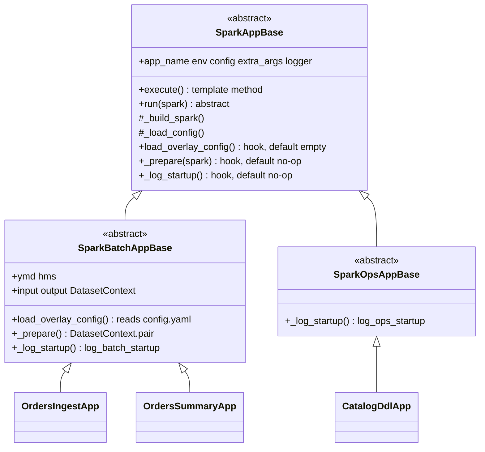

# Spark App Framework

Design notes for the `spark_app` PySpark execution framework in this repository.

For setup and CLI usage, see the root [README](../README.md). This page is a map — the
details live in three focused docs:

- **[lifecycle.md](spark-app/lifecycle.md)** — how an app runs, the template-method
  lifecycle, and a walk through the core flow. **Start here.**
- **[config.md](spark-app/config.md)** — config merge, `load_global` vs `load`, the
  SparkSession builder, startup logs.
- **[datasets.md](spark-app/datasets.md)** — `self.input` / `self.output`, dataset
  resolution, the type registry, storage layout.

## Goals

- Provide a **single entrypoint** for all Spark apps (`spark_app.entrypoint`).
- Merge **environment infra config** and **per-app config** once at build time.
- Resolve **input/output datasets** from YAML so apps do not hard-code paths or table names.
- Keep the framework small enough to run locally and extend as new dataset types or infra
  are added.

## App layout

Each app is a Python package under `spark_app/` whose `app.py` defines exactly one concrete
`SparkAppBase` subclass — either a `SparkBatchAppBase` app (ymd/hms-partitioned, requires
`config.yaml`) or a `SparkOpsAppBase` app (one-off/maintenance, `config.yaml` optional):

```
spark_app/
└── sample/orders_summary/
    ├── app.py        # OrdersSummaryApp(SparkBatchAppBase)
    └── config.yaml   # app-specific config (merged on top of global)

spark_app/catalog/
└── ddl/
    └── app.py        # CatalogDdlApp(SparkOpsAppBase) — no config.yaml needed
```

Run by dotted package name:

```bash
mise run spark-app \
  --app_name sample.orders_summary \
  --env local \
  --ymd 2026-07-01 \
  --hms 120000
```

`--ymd`/`--hms` are required only when `--app_name` resolves to a `SparkBatchAppBase`
subclass (`AppFactory` checks this after importing the app class); `SparkOpsAppBase` apps
reject them.

Package depth is not limited — e.g. `mart.orders.daily_summary` maps to
`spark_app/mart/orders/daily_summary/app.py`. Intermediate directories must be valid Python
packages (`__init__.py`).

## Class hierarchy



`SparkBatchAppBase` and `SparkOpsAppBase` are **siblings**, not parent/child. Both fill the
same hooks that `SparkAppBase.execute()` calls; each fills them differently. See
[lifecycle.md](spark-app/lifecycle.md#the-one-idea-a-template-method-with-holes) for the
hook-by-hook breakdown.

| Base | ymd/hms | `config.yaml` | Datasets | Example apps |
|------|---------|---------------|----------|--------------|
| `SparkBatchAppBase` | required | required | `self.input` / `self.output` | `OrdersIngestApp`, `OrdersSummaryApp` |
| `SparkOpsAppBase` | rejected | optional | none | `CatalogDdlApp` (+ future Iceberg compaction) |

## Core components

| Class / function | Module | Role |
|------------------|--------|------|
| **AppFactory** | `common/app_factory.py` | **Factory** — parse CLI, import & find the app class, require `--ymd`/`--hms` only for Batch apps |
| **ConfigLoader** | `common/config/loader.py` | `load_global(env)` and `load(app_name, env)`; `${VAR}` expand via `config/merge.expand_env` |
| **SparkAppBase** | `common/bases/base.py` | **Template Method** — fixed lifecycle: load config → build spark → `_prepare` → `_log_startup` → `run` → stop |
| **SparkBatchAppBase** | `common/bases/batch.py` | ymd/hms, required `config.yaml`, builds `self.input`/`self.output` |
| **SparkOpsAppBase** | `common/bases/ops.py` | No ymd/hms/datasets; `config.yaml` optional |
| **build_spark_session** | `common/spark_session.py` | Pure `(app_name, config) → SparkSession`, shared by app bases and notebooks |
| **DatasetContext** | `common/datasets/context.py` | One per yaml group (`input`/`output`): resolved `Dataset`s, `read`/`write`, `("env")` cross-env |
| **Dataset** | `common/datasets/models.py` | **Strategy** — yaml spec → location via `from_spec()`; IO in `read()`/`write()` |

Supporting modules: `config/merge.py` (`deep_merge`, `expand_env`, `load_yaml`),
`bases/logging.py` (`log_batch_startup`, `log_ops_startup`), `datasets/registry.py`
(**Registry** — explicit `type → class` map).

## Testing

`tests/` contains **framework smoke tests only** — mock-based, no Docker/MinIO/Spark cluster
required.

Coverage: `ConfigLoader` (merge + env substitution), `DatasetContext`, `AppFactory`,
`SparkAppBase` / `SparkBatchAppBase` / `SparkOpsAppBase`, `CatalogDdlApp`.

Integration / E2E tests against real infra are not included yet.

Run: `mise run test`
