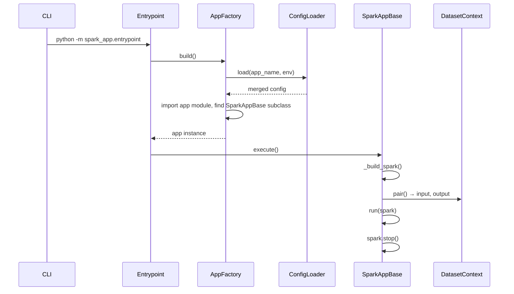

# Spark App Framework

Design notes for the `spark_app` PySpark execution framework in this repository.

For setup and CLI usage, see the root [README](../README.md).

## Goals

- Provide a **single entrypoint** for all Spark apps (`spark_app.entrypoint`).
- Merge **environment infra config** and **per-app config** once at build time.
- Resolve **input/output datasets** from YAML so apps do not hard-code paths or table names.
- Keep the framework small enough to run locally and extend as new dataset types or infra are added.

## App layout

Each app is a Python package under `spark_app/` with exactly two required files:

```
spark_app/
└── sample/hello_world/
    ├── app.py        # exactly one SparkAppBase subclass
    └── config.yaml   # app-specific config (merged on top of global)
```

Run by dotted package name:

```bash
mise run spark-app \
  --app_name sample.hello_world \
  --env local \
  --ymd 2026-07-01 \
  --hms 120000
```

Package depth is not limited — e.g. `mart.orders.daily_summary` maps to `spark_app/mart/orders/daily_summary/app.py`. Intermediate directories must be valid Python packages (`__init__.py`).

## Execution flow



| Step | When |
|------|------|
| Config merge | `AppFactory.build()` — once per run |
| Dataset resolve | `SparkAppBase.execute()` — after SparkSession exists |
| Startup logging | After datasets are resolved (includes final locations) |

## Core components

| Class | Module | Role |
|-------|--------|------|
| **AppFactory** | `common/app_factory.py` | **Factory** — parse CLI, validate app layout, dynamically load app class, call `ConfigLoader.load()` |
| **ConfigLoader** | `common/config/loader.py` | Load global + app YAML and `deep_merge` (app wins at leaf keys) |
| **SparkAppBase** | `common/bases/base.py` | **Template Method** — fixed lifecycle: spark → datasets → log → `run()` → stop |
| **DatasetContext** | `common/datasets/context.py` | One instance per yaml group (`input` or `output`): holds resolved `Dataset` objects, exposes `read`/`write`, supports `("env")` for cross-env |
| **Dataset** | `common/datasets/models.py` | **Strategy** — yaml spec → location via `from_spec()`; actual IO in `read()` / `write()` |

`DatasetContext.pair()` builds `self.input` and `self.output` on `SparkAppBase`. Both share an internal `_DatasetBinding` (spark, run args, merged config, per-env resolve cache) so config is not loaded or parsed twice.

Supporting modules: `config/merge.py`, `bases/logging.py`, `datasets/registry.py` (**Registry** — explicit `type → class` map).

## Config

Two layers merged by `--env`:

```
spark_app/config/{local|sandbox}/global-config.yaml
  + spark_app/{app_name}/config.yaml
  → deep merge (app overrides global at leaf keys)
```

Global config holds infra defaults (`catalog`, `datasets.warehouse`, `spark.master`). App config overrides specific keys (e.g. shuffle partitions) and declares `datasets.input` / `datasets.output` specs.

`SparkAppBase._build_spark()` applies merged `spark.master` and `spark.configs` to the SparkSession builder.

### Startup log (merged + resolved)

After merge and dataset resolve, `log_app_startup()` prints four lines. Example for `sample.hello_world` with `--env local --ymd 2026-07-01 --hms 120000`:

```
INFO Spark app | [local] sample.hello_world (ymd=2026-07-01, hms=120000)
INFO Extra args | {}
INFO Config | {"catalog": {"name": "iceberg"}, "spark": {"master": "local[*]", "configs": {"spark.sql.shuffle.partitions": "1"}}}
INFO Datasets | {"input": {"orders": {"type": "table", "location": "iceberg.raw.orders", "metadata": {}}, "impression": {"type": "table", "location": "s3a://localhost:9000/warehouse/landing/impression/ymd=2026-07-01", "metadata": {"format": "parquet", "catalog": "iceberg"}}}, "output": {"main": {"type": "path", "location": "s3a://localhost:9000/warehouse/mart/hello_world/ymd=2026-07-01", "metadata": {"format": "parquet", "mode": "overwrite"}}}}
```

What this shows:

- **Config line** — merged infra without the `datasets` section. Note `spark.sql.shuffle.partitions` is `"1"` (app override), not `"4"` from global.
- **Datasets line** — fully resolved locations: catalog prefix on tables, `{ymd}` substituted, relative paths joined with `warehouse` from global config.

The `datasets` block is omitted from the Config line because it is logged separately once resolved.

## Datasets

### Config shape

Under `datasets` in merged config:

- `warehouse` — base storage path, **set in global config** (`datasets.warehouse`). Relative paths in app specs are resolved as `{warehouse}/{path}`.
- `input` / `output` — named dataset specs (declared in app config).

Each spec requires an explicit `type` field (`path` or `table`). Types are not inferred from YAML keys.

Templates `{ymd}`, `{hms}`, `{env}` are substituted at resolve time from CLI args.

### App API

In `run()`, use `self.input` and `self.output` — each is a `DatasetContext` for that yaml group:

```python
orders = self.input.read("orders")
self.output.write("main", orders)

# Cross-env (reloads config for that env on first use)
self.input("sandbox").read("orders")
self.output("sandbox").write("main", orders)
```

- **`read` / `write`** on the context look up a named `Dataset` and delegate IO to it.
- **`self.input["orders"]`** returns the resolved `Dataset` (e.g. for `.location`).

### How DatasetContext is built

```
DatasetContext.pair(app_name, env, ymd, hms, spark, config)
  → _DatasetBinding (shared: spark, config, cache)
  → self.input  = DatasetContext(binding, kind="input")
  → self.output = DatasetContext(binding, kind="output")
```

Resolve flow inside binding:

```
yaml spec → registry (type → class) → Dataset.from_spec() → dict[name, Dataset]
```

`ResolveContext` supplies `warehouse`, `catalog`, and `{ymd}` / `{hms}` / `{env}` templates from merged config + CLI args.

### Type registry

| `type` | Class | Notes |
|--------|-------|-------|
| `path` | `PathDataset` | File paths under `warehouse`; generic format/options IO in base `Dataset` |
| `table` | `TableDataset` | Catalog table or path-based table (`by_path`) |

One `PathDataset` handles all URI schemes (local, s3, hdfs) — no split by filesystem.

### Adding a dataset type

1. Create `common/datasets/types/<type>.py` — subclass `Dataset`, implement `from_spec()`, override `read`/`write` when IO differs.
2. Register in `common/datasets/registry.py`.

## SparkAppBase

Apps subclass `SparkAppBase` and implement only `run(self, spark)`.

| Member | Description |
|--------|-------------|
| `self.input` | Input `DatasetContext` — `read()`, `["name"]`, `("env")` |
| `self.output` | Output `DatasetContext` — `write()`, `["name"]`, `("env")` |
| `self.logger` | Logger for the app module |
| `self._config` | Merged config dict |
| `self._extra_args` | CLI key-value pairs after required args |

## Tooling: mise + uv

| Tool | Why |
|------|-----|
| **mise** | Pin Python version, run project tasks, auto-activate venv on `cd` |
| **uv** | Fast dependency install/sync, consistent `uv run` execution |

```bash
mise run setup    # install Python + uv sync
mise run test     # pytest
mise run sample   # smoke-run hello_world
```

## Testing

Fixture-based smoke tests in `tests/` (no real infra): `ConfigLoader`, `DatasetContext`, `AppFactory`, `SparkAppBase`.

Run: `mise run test`
