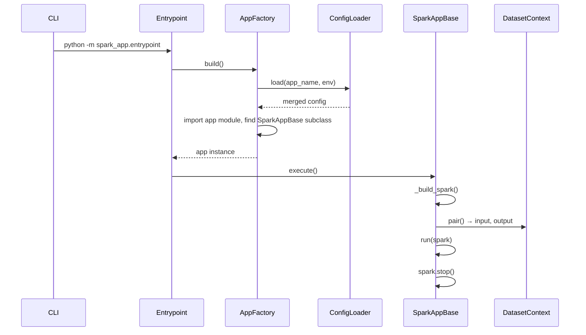

# Spark App Framework

Design notes for the `spark_app` PySpark execution framework in this repository.

For setup and CLI usage, see the root [README](../README.md).

## Goals

- Provide a **single entrypoint** for all Spark apps (`spark_app.entrypoint`).
- Merge **environment infra config** and **per-app config** once at build time.
- Resolve **input/output datasets** from YAML so apps do not hard-code paths or table names.
- Keep the framework small enough to run locally and extend as new dataset types or infra are added.

## App layout

Each app is a Python package under `spark_app/` with exactly two required files:

```
spark_app/
└── sample/orders_summary/
    ├── app.py        # exactly one SparkAppBase subclass
    └── config.yaml   # app-specific config (merged on top of global)
```

Run by dotted package name:

```bash
mise run spark-app \
  --app_name sample.orders_summary \
  --env local \
  --ymd 2026-07-01 \
  --hms 120000
```

Package depth is not limited — e.g. `mart.orders.daily_summary` maps to `spark_app/mart/orders/daily_summary/app.py`. Intermediate directories must be valid Python packages (`__init__.py`).

## Execution flow



| Step | When |
|------|------|
| Config load + merge | `AppFactory.build()` — `.env.{env}`, yaml merge, `${VAR}` expand |
| Dataset resolve | `SparkAppBase.execute()` — after SparkSession exists |
| Startup logging | After datasets are resolved (includes final locations) |

## Core components

| Class | Module | Role |
|-------|--------|------|
| **AppFactory** | `common/app_factory.py` | **Factory** — parse CLI, validate app layout, dynamically load app class, call `ConfigLoader.load()` |
| **ConfigLoader** | `common/config/loader.py` | Load `.env.{env}`, merge global + app YAML, expand `${VAR}` via `string.Template` |
| **SparkAppBase** | `common/bases/base.py` | **Template Method** — fixed lifecycle: spark → datasets → log → `run()` → stop |
| **DatasetContext** | `common/datasets/context.py` | One instance per yaml group (`input` or `output`): holds resolved `Dataset` objects, exposes `read`/`write`, supports `("env")` for cross-env |
| **Dataset** | `common/datasets/models.py` | **Strategy** — yaml spec → location via `from_spec()`; actual IO in `read()` / `write()` |

`DatasetContext.pair()` builds `self.input` and `self.output` on `SparkAppBase`. Both share an internal `_DatasetBinding` (spark, run args, merged config, per-env resolve cache) so config is not loaded or parsed twice.

Supporting modules: `config/merge.py`, `bases/logging.py`, `datasets/registry.py` (**Registry** — explicit `type → class` map).

## Config

```
.env.{env}  +  spark_app/config/{env}/global-config.yaml  +  spark_app/{app_name}/config.yaml
  → deep merge (app overrides global at leaf keys)
  → ${VAR} substitution from os.environ (via .env.{env})
```

`--env` selects the config directory and dotenv file. Global: `catalog`, `datasets.warehouse`, `spark.*`. App: `datasets.input` / `output`. Secrets stay in `.env.{env}` — see `.env.{env}.example`.

`SparkAppBase._build_spark()` applies merged `spark.master` and `spark.configs`.

### Startup log (merged + resolved)

After merge and dataset resolve, `log_app_startup()` prints four lines. Example for `sample.orders_summary` with `--env local`:

```
INFO Spark app | [local] sample.orders_summary (ymd=2026-07-16, hms=162753)
INFO Extra args | {}
INFO Config | {"catalog": {"name": "iceberg"}, "spark": {"master": "local[*]", "configs": {"spark.sql.shuffle.partitions": "1", "spark.hadoop.fs.s3a.endpoint": "http://localhost:9000", ...}}}
INFO Datasets | {"input": {"orders": {"type": "path", "location": "s3a://local/raw/fixtures/orders/orders.parquet", "metadata": {"format": "parquet"}}}, "output": {}}
```

What this shows:

- **Config line** — merged infra without the `datasets` section. Resolved secrets appear as plain values (not `${...}`). App overrides global leaf keys (e.g. `spark.sql.shuffle.partitions: "1"`).
- **Datasets line** — fully resolved locations: `{warehouse}/{path}`, `{ymd}` substituted where used.

The `datasets` block is omitted from the Config line because it is logged separately once resolved.

## Datasets

### Config shape

Under `datasets` in merged config:

- `warehouse` — base storage URI (`s3a://{env}`). **Bucket name matches `--env`** (`local`, `homelab`, `aws`). App paths are resolved as `{warehouse}/{path}`.
- `input` / `output` — named dataset specs (declared in app config).

Each spec requires an explicit `type` field (`path` or `table`). Types are not inferred from YAML keys.

Templates `{ymd}`, `{hms}`, `{env}` are substituted at resolve time from CLI args.

### App API

In `run()`, use `self.input` and `self.output` — each is a `DatasetContext` for that yaml group:

```python
orders = self.input.read("orders")

# Cross-env (reloads config for that env on first use)
self.input("homelab").read("orders")
```

- **`read` / `write`** on the context look up a named `Dataset` and delegate IO to it.
- **`self.input["orders"]`** returns the resolved `Dataset` (e.g. for `.read(spark)` or `.location`).

### How DatasetContext is built

```
DatasetContext.pair(app_name, env, ymd, hms, spark, config)
  → _DatasetBinding (shared: spark, config, cache)
  → self.input  = DatasetContext(binding, kind="input")
  → self.output = DatasetContext(binding, kind="output")
```

Resolve flow inside binding:

```
yaml spec → registry (type → class) → Dataset.from_spec() → dict[name, Dataset]
```

`ResolveContext` supplies `warehouse`, `catalog`, and `{ymd}` / `{hms}` / `{env}` templates from merged config + CLI args.

### Type registry

| `type` | Class | Notes |
|--------|-------|-------|
| `path` | `PathDataset` | File paths under `warehouse`; generic format/options IO in base `Dataset` |
| `table` | `TableDataset` | Catalog table or path-based table (`by_path`) |

One `PathDataset` handles all URI schemes (s3a, file, hdfs) — storage backend is determined by `warehouse` and spark configs, not by dataset type.

### Storage layout

Paths are **the same across envs**; isolation is by bucket (`--env`) and credentials (`.env.{env}`).

```
s3a://{env}/
  raw/{domain}/{table}/...
  refined/{domain}/{table}/...
  mart/{domain}/{table}/...
```

Catalog (Iceberg REST): **`iceberg.{layer}.{domain}.{table}`** — e.g. `iceberg.refined.sample.orders`.  
yaml: `table: refined.sample.orders`.

DDL: `catalog/ddl/{layer}/{domain}/{table}.sql` — apply with `mise run catalog:apply --env local --layer refined --domain sample --table orders`.

Table write modes: `append`, `overwrite_partitions` only (DDL-first; no `createOrReplace` on catalog tables).

### Adding a dataset type

1. Create `common/datasets/types/<type>.py` — subclass `Dataset`, implement `from_spec()`, override `read`/`write` when IO differs.
2. Register in `common/datasets/registry.py`.

## SparkAppBase

Apps subclass `SparkAppBase` and implement only `run(self, spark)`.

| Member | Description |
|--------|-------------|
| `self.input` | Input `DatasetContext` — `read()`, `["name"]`, `("env")` |
| `self.output` | Output `DatasetContext` — `write()`, `["name"]`, `("env")` |
| `self.logger` | Logger for the app module |
| `self._config` | Merged config dict |
| `self._extra_args` | CLI key-value pairs after required args |

Setup, local infra, and mise tasks: root [README](../README.md).

## Testing

`tests/` contains **framework smoke tests only** — mock-based, no Docker/MinIO/Spark cluster required.

Coverage: `ConfigLoader` (merge + env substitution), `DatasetContext`, `AppFactory`, `SparkAppBase`.

Integration / E2E tests against real infra are not included yet.

Run: `mise run test`
