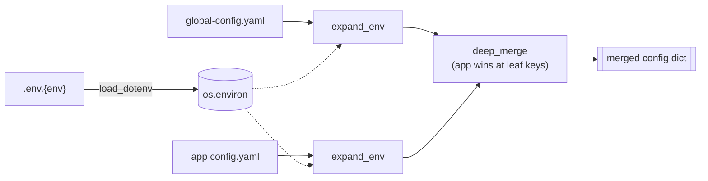

# Config

How an app's merged config is assembled, and how the same building blocks are reused
outside the app framework (notebooks).

Back to the [framework overview](../spark-app-framework.md) · lifecycle context in
[lifecycle.md](lifecycle.md).

## The merge pipeline

```
.env.{env}                                   → secrets into os.environ (via load_dotenv)
spark_app/config/{env}/global-config.yaml    → shared infra (catalog, warehouse, spark.*)
spark_app/{app_name}/config.yaml             → per-app (datasets.input / output, overrides)
```



`--env` selects both the dotenv file and the config directory. `${VAR}` placeholders are
substituted from `os.environ` (populated by `.env.{env}`); a missing variable raises
`ValueError` rather than silently blanking.

## Two entry points: `load_global` vs `load`

`ConfigLoader` (`common/config/loader.py`) exposes two class methods. The difference is
just *whether an app overlay is merged in*:

| Method | Reads | Used by |
|--------|-------|---------|
| `load_global(env)` | `.env.{env}` + `global-config.yaml`, `${VAR}`-expanded | Ops apps (no overlay), **notebooks**, and internally by `load()` |
| `load(app_name, env)` | `load_global(env)` **+** the app's `config.yaml` | `SparkBatchAppBase` apps (via the `load_overlay_config()` hook) |

`load_global()` is self-contained and expands `${VAR}` itself, so it is safe to call
directly. Expansion only substitutes from `os.environ` (never from sibling config keys),
so expanding the global and the overlay separately and *then* merging gives the same result
as merging first — which is why the app base and `load()` can expand each piece
independently.

### How apps trigger the merge

Apps do not call `ConfigLoader` directly. `SparkAppBase.__init__` does it through a hook:

```python
# common/bases/base.py
def _load_config(self) -> dict:
    global_config = ConfigLoader.load_global(self._env)   # already expanded
    overlay = expand_env(self.load_overlay_config())      # {} for Ops, config.yaml for Batch
    return deep_merge(global_config, overlay)
```

`load_overlay_config()` is the "hole" (see [lifecycle.md](lifecycle.md#the-one-idea-a-template-method-with-holes)):
`SparkBatchAppBase` fills it by reading the app's required `config.yaml`; `SparkOpsAppBase`
leaves it as `{}`.

## Building the SparkSession

`spark.master` and `spark.configs` from the merged config feed a single pure function:

```python
# common/spark_session.py
build_spark_session(app_name, config) -> SparkSession
```

`SparkAppBase._build_spark()` is a one-line wrapper over it. The same function is what
notebooks call directly — no app object required:

```python
from spark_app.common.config.loader import ConfigLoader
from spark_app.common.spark_session import build_spark_session

spark = build_spark_session("notebooks", ConfigLoader.load_global("local"))
```

This is the payoff of extracting the builder: session creation lives in exactly one place,
used identically by the app framework, the DDL job, and notebooks.

## Startup log (merged + resolved)

Right before `run()`, the `_log_startup()` hook prints the effective configuration.
`log_batch_startup()` (Batch) and `log_ops_startup()` (Ops) live in `common/bases/logging.py`.
Example for `sample.orders_summary` (Batch) with `--env local`:

```
INFO Spark app | [local] sample.orders_summary (ymd=2026-07-16, hms=162753)
INFO Extra args | {}
INFO Config | {"catalog": {"name": "iceberg"}, "spark": {"master": "local[*]", "configs": {"spark.sql.shuffle.partitions": "1", "spark.hadoop.fs.s3a.endpoint": "http://localhost:9000", ...}}}
INFO Datasets | {"input": {"orders": {"type": "path", "location": "s3a://local/raw/fixtures/orders/orders.parquet", "metadata": {"format": "parquet"}}}, "output": {}}
```

- **Config line** — merged infra without the `datasets` section. Resolved secrets appear as
  plain values (not `${...}`). App overrides win at leaf keys (e.g.
  `spark.sql.shuffle.partitions: "1"`).
- **Datasets line** — fully resolved locations: `{warehouse}/{path}`, `{ymd}` substituted.
  Ops apps omit this line (`log_ops_startup()` has no datasets).

The `datasets` block is dropped from the Config line because it is logged separately once
resolved.

## What lives where

| Concern | Global (`global-config.yaml`) | App (`config.yaml`) |
|---------|-------------------------------|---------------------|
| `catalog.name` | ✅ | — |
| `datasets.warehouse` | ✅ (`s3a://{env}`) | — |
| `spark.master`, `spark.configs` | ✅ | override leaf keys as needed |
| `datasets.input` / `datasets.output` | — | ✅ |
| secrets (`${VAR}`) | referenced here | resolved from `.env.{env}` |
