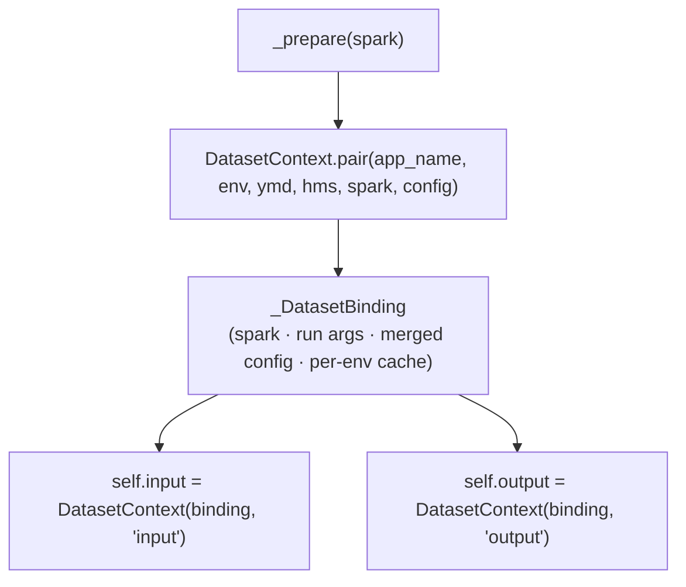
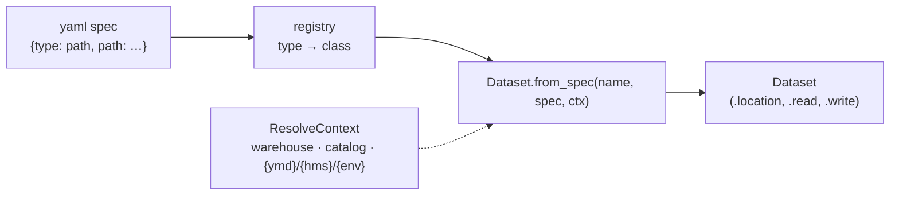

# Datasets

How apps read and write data without hard-coding paths or table names. Only
`SparkBatchAppBase` apps get datasets — `SparkOpsAppBase` apps skip this entirely.

Back to the [framework overview](../spark-app-framework.md) · lifecycle context in
[lifecycle.md](lifecycle.md).

## Config shape

Under `datasets` in the merged config:

- `warehouse` — base storage URI (`s3a://{env}`). **Bucket name matches `--env`**
  (`local`, `homelab`, `aws`). App paths resolve as `{warehouse}/{path}`.
- `input` / `output` — named dataset specs, declared in the app's `config.yaml`.

Each spec needs an explicit `type` field (`path` or `table`) — types are **not** inferred
from yaml keys. Templates `{ymd}`, `{hms}`, `{env}` are substituted at resolve time from CLI
args.

## App API

In `run()`, use `self.input` and `self.output` — each is a `DatasetContext` for that yaml
group:

```python
orders = self.input.read("orders")          # DataFrame
self.output.write("main", result_df)

self.input["orders"]                         # the resolved Dataset (for .location etc.)
self.input("homelab").read("orders")         # cross-env: reload config for that env
```

- **`read` / `write`** look up a named `Dataset` and delegate IO to it.
- **`self.input["orders"]`** returns the resolved `Dataset` object itself.
- **`self.input("env")`** returns a context bound to another env (config for that env is
  loaded lazily on first use).

## How the two contexts are built

`SparkBatchAppBase._prepare()` calls `DatasetContext.pair()` after the SparkSession exists.
Both contexts share one `_DatasetBinding` so config is parsed once, not twice:



## How a spec resolves to a Dataset

Inside the binding, each yaml spec becomes a typed `Dataset` object via the registry
(**Registry** pattern) and `Dataset.from_spec()` (**Strategy** pattern):



`ResolveContext` supplies `warehouse`, `catalog`, and the `{ymd}` / `{hms}` / `{env}`
template values from the merged config + CLI args. Resolution is **eager** — a bad spec
fails when the context is built, not mid-`run()`.

## Type registry

| `type` | Class | Notes |
|--------|-------|-------|
| `path` | `PathDataset` | File paths under `warehouse`; generic format/options IO in base `Dataset` |
| `table` | `TableDataset` | Catalog table or path-based table (`by_path`) |

One `PathDataset` handles every URI scheme (s3a, file, hdfs) — the storage backend is
decided by `warehouse` + spark configs, not by the dataset type.

## Storage layout

Paths are **the same across envs**; isolation is by bucket (`--env`) and credentials
(`.env.{env}`):

```
s3a://{env}/
  raw/{domain}/{table}/...
  refined/{domain}/{table}/...
  mart/{domain}/{table}/...
```

Catalog (Iceberg REST): **`iceberg.{layer}.{domain}.{table}`** — e.g.
`iceberg.refined.sample.orders`. In yaml: `table: refined.sample.orders`.

DDL: `catalog/ddl/{layer}/{domain}/{table}.sql`, applied via
`mise run catalog:apply --env local --layer refined --domain sample --table orders`
(the `CatalogDdlApp` Ops app).

Table write modes: `append`, `overwrite_partitions` only (DDL-first; no `createOrReplace`
on catalog tables).

## Adding a dataset type

1. Create `common/datasets/types/<type>.py` — subclass `Dataset`, implement `from_spec()`,
   override `read` / `write` when IO differs from the base.
2. Register it in `common/datasets/registry.py`.
