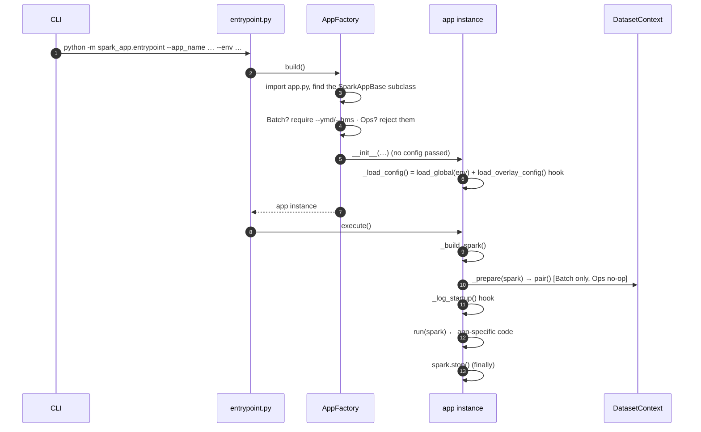

# App Lifecycle

How a Spark app goes from a CLI command to a running job. Start here if you want to
rebuild your mental model of the framework — this is the single thread everything else
hangs off.

Back to the [framework overview](../spark-app-framework.md).

## The one idea: a template method with holes

`SparkAppBase.execute()` fixes the *order* of a Spark app's lifecycle once. It does not
know anything app-specific — instead it calls **hooks** (empty or default methods) at the
right moments, and subclasses fill those holes in. This is the classic
[Template Method](https://refactoring.guru/design-patterns/template-method) pattern.

```python
# common/bases/base.py  (simplified)
def execute(self) -> None:
    spark = self._build_spark()
    try:
        self._prepare(spark)      # hook — Batch builds datasets here; Ops leaves it empty
        self._log_startup()       # hook — Batch vs Ops log different things
        self.run(spark)           # abstract — the only thing every app MUST write
    finally:
        spark.stop()
```

Read that block and you have read 80% of the framework. Everything below is *which class
fills which hole*.

| Hole (hook) | `SparkAppBase` default | `SparkBatchAppBase` fills with | `SparkOpsAppBase` fills with |
|-------------|------------------------|--------------------------------|------------------------------|
| `load_overlay_config()` | `{}` (global config only) | reads the app's `config.yaml` (required) | `{}` (override if a job needs its own yaml) |
| `_prepare(spark)` | no-op | `DatasetContext.pair()` → `self.input` / `self.output` | no-op |
| `_log_startup()` | no-op | `log_batch_startup()` (+ ymd/hms, datasets) | `log_ops_startup()` |
| `run(spark)` | *abstract* | *abstract* | *abstract* |

## Walking the core flow

Follow these four files in order and the split stops feeling like scattered pieces.

### 1. `entrypoint.py` — the front door

```python
def main():
    app = AppFactory().build()
    app.execute()
```

That is the entire entrypoint. Two lines: build an app object, run it. No app-specific
logic lives here, which is why one entrypoint serves every app.

### 2. `AppFactory.build()` — CLI → app object

`common/app_factory.py` turns `--app_name sample.orders_summary --env local ...` into a
concrete app instance:

1. Resolve the dotted `--app_name` to a package dir and import its `app.py`.
2. Find the single `SparkAppBase` subclass in that module (Batch **or** Ops — the factory
   accepts both).
3. Decide about `--ymd`/`--hms`: **required** if the class is a `SparkBatchAppBase`,
   **rejected** otherwise. This is the one branch that makes a generic factory serve two
   app families.
4. Instantiate the class. Note: it does **not** pass `config=` — the app loads its own
   config (next step).

### 3. `SparkAppBase.__init__` — config loads itself

When the app object is constructed, it builds its own merged config (unless a caller
passed `config=` explicitly, which tests do):

```python
self._config = config if config is not None else self._load_config()
```

`_load_config()` = global config for the env **+** the `load_overlay_config()` hook. For a
Batch app the overlay is its `config.yaml`; for an Ops app it is empty. Details in
[config.md](config.md).

### 4. `execute()` — the fixed lifecycle

Now the template method above runs. The only per-app difference is which hooks fire with
real bodies. For `sample.orders_summary` (a Batch app):

- `_build_spark()` → a `SparkSession` from the merged `spark.*` config
- `_prepare(spark)` → resolves `self.input` / `self.output` from the yaml `datasets` block
- `_log_startup()` → prints env / app / ymd / hms / config / datasets
- `run(spark)` → **your code** — the only method `OrdersSummaryApp` actually defines

## Sequence diagram



## Why this shape

Before the split, `SparkAppBase` held ymd/hms, `DatasetContext`, config loading, and the
lifecycle all at once — which forced the DDL runner to live *outside* the framework as a
standalone script and re-implement session building and config loading by hand. Splitting
the lifecycle into hooks let that job (now `CatalogDdlApp`, and future Iceberg compaction
jobs) reuse the same bootstrap while skipping the dataset machinery they don't need. See the
[class hierarchy](../spark-app-framework.md#class-hierarchy) for who inherits what.

## App API surface (what you get in `run`)

Every app implements only `run(self, spark)`. Available members:

| Member | Available on | Description |
|--------|--------------|-------------|
| `self.app_name`, `self.env` | all apps | as passed on the CLI |
| `self.config` | all apps | merged config dict (see [config.md](config.md)) |
| `self.extra_args` | all apps | CLI key-value pairs after the known args |
| `self.logger` | all apps | logger named for the app module |
| `self.ymd`, `self.hms` | Batch only | partition date/time from the CLI |
| `self.input`, `self.output` | Batch only | `DatasetContext` (see [datasets.md](datasets.md)) |

## Where to look next

- Config merge and the startup log → [config.md](config.md)
- `self.input` / `self.output` and dataset resolution → [datasets.md](datasets.md)
